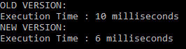

# OS Lab 5 - Memory optimization


## Main part


Задание нашей лабораторной работы -оптимизировать работу программы. Сам код создает трехмерный массив и прибалвяет к каждому значению этого массива единицу.


### Старая версия
```
    int[,,] b = new int[100, 100, 100];
            int res = 0;

            for (int j = 0; j < 100; j++)
            {
                for (int i = 0; i < 100; i++)
                {
                    for (int k = 0; k < 100; k++)
                    {
                        b[k, j, i]++;                        
                    }
                }                
            }  
```

### Оптимизированная версия

```
    int[,,] c = new int[100, 100, 100];            

            for (int j = 0; j < 100; j++)
            {
                for (int i = 0; i < 100; i++)
                {
                    for (int k = 0; k < 100; k++)
                    {
                        c[j, i, k]++;
                    }
                }
            }
```

### Результат работы программы


